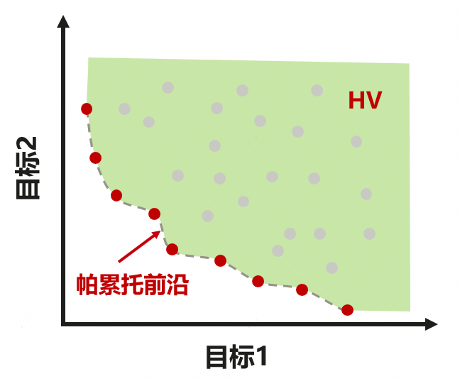
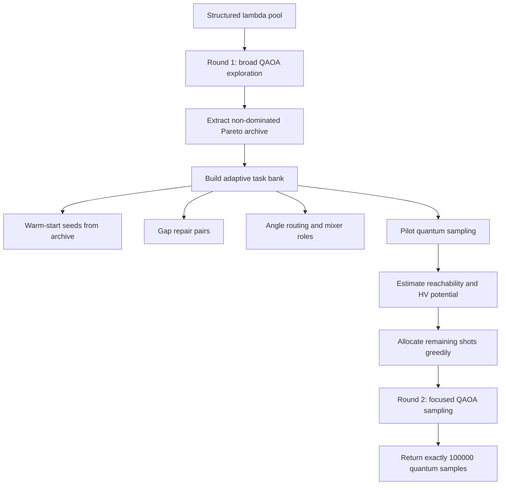
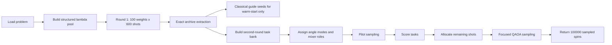
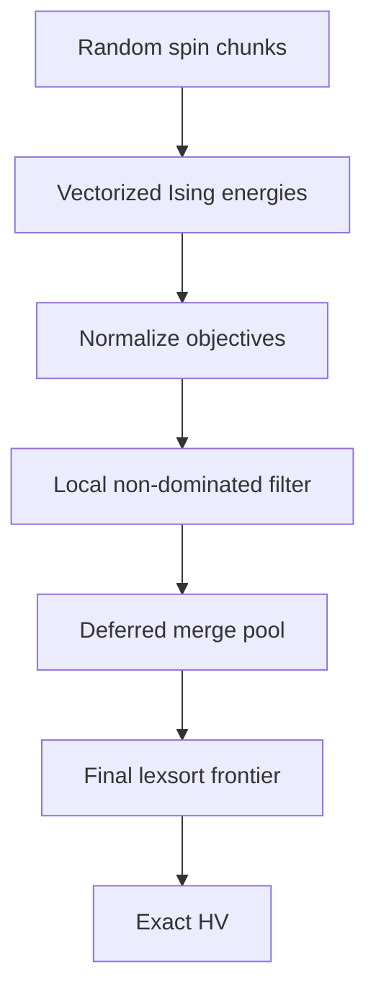

# Quantum Pareto-Aware QAOA for Multi-Objective Ising Optimization

This repository contains a hackathon solution for **multi-objective combinatorial optimization with quantum sampling**.  The task is to approximate the Pareto frontier of five conflicting Ising objectives under a fixed quantum sampling budget, and to maximize the final normalized hypervolume.

The final solver is implemented in [`answer_210_08.py`](answer_210_08.py).  It is not a plain fixed-weight QAOA sweep.  Instead, it uses a **Pareto-archive feedback controller**: an initial quantum exploration round builds a frontier archive, then the second round dynamically chooses warm-start seeds, scalarization weights, transfer-angle modes, local mixer variants, and shot allocation according to estimated hypervolume contribution.

## Problem

Each binary decision variable is represented by an Ising spin

$$
z_i \in \{-1,+1\}, \qquad i=1,\dots,n.
$$

The public small cases use a \(4 \times 5\) grid, so \(n=20\).  The graph topology is shared by all objectives.


For \(k=5\) objectives, the \(t\)-th objective is an Ising energy

$$
f^{(t)}(z)
=
\sum_i h_i^{(t)} z_i
+
\sum_{(i,j)\in E} J_{ij}^{(t)} z_i z_j,
\qquad t=1,\dots,k.
$$

The goal is not to minimize a single scalar value.  We need a set of samples whose objective vectors

$$
F(z)=\left(f^{(1)}(z),\dots,f^{(k)}(z)\right)
$$

cover the non-dominated Pareto frontier.

A sample \(a\) dominates sample \(b\) if

$$
F_i(a) \le F_i(b)\ \forall i,
\qquad
\exists j:\ F_j(a) < F_j(b).
$$

Only non-dominated points contribute to the final frontier.

## Evaluation Metric

For small cases, every objective is normalized by exact extrema:

$$
\hat f_i(z)
=
\frac{f_i(z)-\ell_i}{u_i-\ell_i},
\qquad
\ell_i=\min_z f_i(z),
\qquad
u_i=\max_z f_i(z).
$$

The judge computes hypervolume with reference point

$$
r=(1.01,\dots,1.01).
$$

For a non-dominated set \(P\), the minimization hypervolume is

$$
HV(P)
=
\lambda_k
\left(
\bigcup_{p\in P}
[p_1,r_1]\times \cdots \times [p_k,r_k]
\right),
$$

where \(\lambda_k\) is \(k\)-dimensional Lebesgue measure.



The small-task score is based on improvement over the official baseline:

$$
Score_{5obj}
=
\frac{1}{|D_5|}
\sum_{d\in D_5}
\max\left(HV_d^{submit}-HV_d^{base},0\right).
$$

The total score is dominated by this term:

$$
Score
=
100000 \cdot Score_{5obj}
+
10 \cdot Score_{large\_bonus}^{raw}.
$$

Therefore, most algorithmic effort is spent on improving the quality of `main1()` samples.

## Why Fixed Weights Are Not Enough

The official baseline scalarizes the five objectives using fixed weights:

$$
f_\lambda(z)
=
\sum_{t=1}^k \lambda_t f^{(t)}(z),
\qquad
\lambda_t\ge 0,\quad
\sum_t \lambda_t=1.
$$

This gives another Ising Hamiltonian:

$$
f_\lambda(z)
=
\sum_i h_i^\lambda z_i
+
\sum_{(i,j)\in E} J_{ij}^\lambda z_i z_j,
$$

with

$$
h_i^\lambda=\sum_t \lambda_t h_i^{(t)},
\qquad
J_{ij}^\lambda=\sum_t \lambda_t J_{ij}^{(t)}.
$$

Fixed scalarization is useful, but it tends to prefer convex and easy-to-reach parts of the frontier.  Hypervolume, however, rewards both:

- extreme points that create large axis-aligned volume slabs,
- sparse gap-filling points that repair holes in the frontier.

The final algorithm therefore treats scalarization weights as **adaptive control variables**, not as a static grid.

## High-Level Algorithm



The key design principle is:

> The classical controller may select quantum circuits, warm starts, and shot budgets, but all returned samples must come from MindQuantum sampling.

Classical local search is used only to propose guide seeds for quantum circuits.  These guide states are **never directly injected into the returned sample matrix**.

## QAOA Formulation

For a scalarized Ising objective \(f_\lambda\), define the cost Hamiltonian

$$
C_\lambda
=
\sum_i h_i^\lambda Z_i
+
\sum_{(i,j)\in E} J_{ij}^\lambda Z_i Z_j.
$$

The standard depth-\(p\) QAOA state is

$$
|\psi_p(\boldsymbol\beta,\boldsymbol\gamma)\rangle
=
\prod_{\ell=1}^{p}
e^{-i\beta_\ell B}
e^{-i\gamma_\ell C_\lambda}
|+\rangle^{\otimes n},
$$

where

$$
B=\sum_i X_i.
$$

In circuit form, the cost layer applies

$$
R_Z(2\gamma h_i^\lambda)
\quad\text{and}\quad
R_{ZZ}(2\gamma J_{ij}^\lambda),
$$

while the mixer layer applies

$$
R_X(2\beta).
$$

The implementation uses transfer angles from `transfer_data.csv`, then applies a small graph- and lambda-aware correction.

## Warm-Start QAOA

Given a promising archive spin \(z^\star\), convert it to a bit value

$$
b_i =
\begin{cases}
0, & z_i^\star=+1,\\
1, & z_i^\star=-1.
\end{cases}
$$

Warm-start QAOA initializes each qubit as

$$
|\theta_i\rangle
=
\cos\frac{\theta_i}{2}|0\rangle
+
\sin\frac{\theta_i}{2}|1\rangle,
$$

where

$$
x_i = (1-c_i)\frac{1}{2}+c_i b_i,
\qquad
\theta_i = 2\arcsin\sqrt{x_i}.
$$

Here \(c_i\in[0,1]\) controls how strongly the circuit is pinned to the archive seed:

- \(c_i=0\): uniform superposition,
- \(c_i=1\): deterministic seed bit,
- intermediate \(c_i\): quantum exploration around the seed.

Unlike a scalar warm-start coefficient, the final solver supports a **per-qubit warm vector** \(c_i\).  This lets stable qubits remain close to a good seed while locally uncertain qubits stay mobile.

## Local Instability and Adaptive Warm Profiles

For a seed spin \(z\), the local field under scalarized coefficients is

$$
g_i^\lambda(z)
=
h_i^\lambda
+
\sum_{j:(i,j)\in E} J_{ij}^\lambda z_j.
$$

Flipping spin \(i\) changes the scalarized energy by

$$
\Delta_i
=
f_\lambda(z^{flip(i)})-f_\lambda(z)
=
-2z_i g_i^\lambda(z).
$$

If \(|g_i^\lambda(z)|\) is small, the bit is locally unstable: many nearby samples can change that coordinate without large scalarized cost.  The solver converts this into an instability score:

$$
s_i
=
\frac{1}{1+|g_i^\lambda|/\operatorname{median}(|g^\lambda|)}.
$$

The warm vector is then reduced on high-instability qubits:

$$
c_i
\approx
c_{base}\left(1-\alpha s_i\right).
$$

This creates a controlled local search region in Hilbert space:

- high-confidence qubits are pinned,
- weak-field qubits are opened,
- the circuit still samples from a valid quantum distribution.

## ADAPT-Lite Mixer

Some tasks receive a focused mixer instead of a uniform mixer.  The single-qubit mixer is scaled as

$$
B_{adapt}
=
\sum_i \eta_i X_i,
\qquad
\eta_i = \operatorname{clip}(0.96 + 0.32s_i,\ 0.92,\ 1.24).
$$

This gives more mixing power to unstable coordinates.

For selected edge pairs, a weak pair mixer is also added.  It targets edges where both endpoints are locally unstable and the coupling is meaningful:

$$
score_{ij}
=
s_i s_j
\left(
0.70 + 0.30
\frac{|J_{ij}^\lambda|}{\max_e |J_e^\lambda|}
\right).
$$

The pair mixer is implemented as a small additional two-qubit rotation in the \(X\)-basis.  Conceptually, it encourages correlated two-bit movement along promising Hamming corridors.

## Pareto Archive Controller

After the first round, all quantum samples are evaluated and reduced to a Pareto archive:

$$
A=\{(\hat F(z),z,count,\lambda)\}.
$$

The controller builds a second-round task bank from four signals.

### 1. Scalarization Winners

For each candidate \(\lambda\), find the archive point with best scalarized objective:

$$
z_\lambda^\star
=
\arg\min_{z\in A}
\lambda^\top \hat F(z).
$$

These points become warm-start seeds.

### 2. Frontier Gap Repair

For neighboring archive points \(a,b\), define a gap score using objective-space distance:

$$
G(a,b)=\|\hat F(a)-\hat F(b)\|_2.
$$

Large gaps indicate missing frontier regions.  The solver constructs repair weights near the objective midpoint:

$$
m=\frac{\hat F(a)+\hat F(b)}{2},
\qquad
\lambda_{gap}
=
\frac{1/(m+\epsilon)}
{\sum_i 1/(m_i+\epsilon)}.
$$

Both endpoints are used as warm seeds, but only their Hamming-disagreement coordinates are opened strongly.  This gives a local quantum corridor between two already-good Pareto representatives.

### 3. Archive Diversity

The algorithm penalizes repeatedly selecting weights that map to the same archive point.  It also preserves simplex diversity by maintaining distances between selected \(\lambda\)'s:

$$
D(\lambda)
=
\min_{\lambda'\in S}
\|\lambda-\lambda'\|_2^2.
$$

This prevents the second round from collapsing into a few redundant scalarized basins.

### 4. Hypervolume Proxy

Exact marginal hypervolume contribution is expensive in 5D during scheduling.  The controller uses a low-cost proxy:

$$
q(z)
=
w_g \cdot gap(z)
+
w_s \cdot spread(z)
+
w_u \cdot uncertainty(z)
+
w_c \cdot center(\lambda).
$$

The implemented constants are tuned for the 5-objective benchmark:

$$
w_g=0.46,\quad
w_s=0.26,\quad
w_u=0.20,\quad
w_c=0.08.
$$

## Pilot Sampling and Shot Allocation

The second round is not allocated uniformly.  The solver first runs a small pilot budget:

$$
120\ \text{shots per pilot task}.
$$

For each task, the pilot samples estimate:

- improvement over the current archive,
- number of unique states,
- number of non-dominated states,
- box-volume proxy,
- objective extreme contribution,
- local region coverage.

These are normalized to \([0,1]\), then combined into a priority score:

$$
\pi_j
=
0.34 I_j
+
0.22 E_j
+
0.21 B_j
+
0.13 N_j
+
0.10 U_j.
$$

An optional Pareto-contribution term blends into this score:

$$
\pi_j
\leftarrow
(1-\rho)\pi_j+\rho C_j.
$$

The remaining budget is distributed approximately as

$$
shots_j
=
shots_{pilot}
+
\left\lfloor
\frac{\pi_j}{\sum_l \pi_l}
B_{remain}
\right\rfloor,
$$

with caps to avoid over-investing in one task.

This is the main difference from a fixed-weight framework: the algorithm lets early quantum evidence decide where later quantum budget is spent.

## Angle Portfolio and Routing

The solver uses multiple transfer-angle modes:

| Mode | Purpose |
| --- | --- |
| `BASE` | robust transferred QAOA angles |
| `PORTFOLIO` | blend angles by lambda shape |
| `CENTER` | favor balanced multi-objective weights |
| `MID` | frontier-gap repair |
| `OPEN` | more exploratory warm-start tasks |

For a weight vector \(\lambda\), the center score is

$$
c_\lambda
=
\operatorname{clip}
\left(
1-\frac{\operatorname{Var}(\lambda)}{0.16},
0,1
\right).
$$

Balanced weights are routed toward center-oriented angles; sparse or extreme weights use more baseline-like angles.

A small correction rescales \(\beta\) and \(\gamma\) using graph and coefficient statistics:

$$
\beta' = \beta \exp(\delta_\beta),
\qquad
\gamma' = \gamma \exp(\delta_\gamma),
$$

where \(\delta_\beta,\delta_\gamma\) depend on average degree, field-to-coupling ratio, coefficient roughness, lambda balance, and task role.  The correction is clipped to a narrow range, so it acts as a stable router rather than a full optimizer.

## Additional Quantum Task Variants

### Fourier Warm Extension

For difficult cases, a few high-priority tasks receive a depth extension.  Instead of directly switching to a disruptive deeper transfer schedule, the solver fits a low-frequency continuation of the working \(p=3\) angles:

$$
\theta(x)
\approx
a_0+\sum_{u=1}^{r} a_u \cos(\pi u x).
$$

The extended schedule is blended with linear interpolation and a small continuation tail.  This gives additional circuit depth while preserving the stable low-frequency shape of the original angles.

### Masked Window Sampling

For high-contribution tasks, the solver constructs a small unstable window of qubits:

$$
W = \operatorname{TopK}_i
\left(
0.74s_i + 0.26 edge_i
\right).
$$

Warm strength and mixer strength are then set differently inside and outside the window:

$$
c_i =
\begin{cases}
c_{inside}, & i\in W,\\
c_{outside}, & i\notin W,
\end{cases}
\qquad
\eta_i =
\begin{cases}
\eta_{inside}, & i\in W,\\
\eta_{outside}, & i\notin W.
\end{cases}
$$

This strongly pins the global seed while allowing a small quantum subspace to explore.

## Complete `main1()` Structure



Important implementation details:

- The first round uses 60,000 shots: `100 weights x 600 shots`.
- The second round uses the remaining 40,000 shots.
- The second round starts from about 70 active tasks, then may add bounded repair or substitution tasks.
- All output rows are produced by `Simulator("mqvector").sampling(...)`.
- Classical guide states are only used to initialize or shape quantum circuits.

## `main2()` Large-Case Acceleration

The large-task objective is different: the frontier must match the baseline random-sampling result, but post-processing should be faster.

The implementation keeps the same random sampling semantics, then accelerates:

1. chunked spin generation,
2. vectorized Ising energy evaluation,
3. local non-dominated filtering,
4. deferred global Pareto merges,
5. optional rank-5 lexicographic non-dominated scan,
6. lazy/final hypervolume computation,
7. optional threaded execution for CPU-bound preprocessing.



The key invariant is correctness: `frontier_objectives_norm`, `nd_count`, and `hv` must match the baseline judge within tolerance.

## Complexity

For one QAOA task with depth \(p\), \(n\) qubits, and \(m\) grid edges, the circuit has approximately

$$
O\left(p(n+m)\right)
$$

parameterized gates, plus small mixer variants for selected tasks.

For archive evaluation over \(S\) sampled rows, energy computation costs

$$
O\left(S(km+kn)\right),
$$

implemented by vectorized NumPy matrix operations.

Pareto extraction is performed on reduced unique batches and first-front subsets, which keeps the scheduling overhead small relative to quantum simulation time.

## Engineering Notes

- Framework: MindQuantum / MindSpore Quantum style circuits.
- Output contract: exactly `100000` rows for `main1()`.
- Hypervolume reference point: `1.01`.
- No direct classical replacement of quantum samples.
- Classical computation is used only for:
  - archive evaluation,
  - task selection,
  - warm-start design,
  - shot allocation,
  - large-case post-processing.

## Project Highlights for Resume

- Designed a **hybrid quantum-classical Pareto controller** for five-objective Ising optimization.
- Replaced fixed scalarized QAOA sweeps with **archive-aware warm-start QAOA**.
- Derived local-field instability profiles to build **per-qubit warm-start vectors** and focused mixers.
- Implemented pilot-shot feedback to allocate quantum sampling budget according to estimated hypervolume potential.
- Optimized large-case frontier post-processing with deferred Pareto merges and vectorized energy evaluation.

## Repository Entry Points

```python
def main1(problem_input, sample_budget=100000, rng_seed=None) -> dict:
    """Return exactly 100000 quantum-sampled spin rows."""

def main2(problem_input, shots=200000, rng_seed=None, chunk_size=4096) -> dict:
    """Return matched large-case frontier and hypervolume with faster processing."""
```

## Suggested GitHub Description

> Pareto-aware warm-start QAOA for quantum multi-objective Ising optimization, with hypervolume-guided shot allocation and optimized frontier post-processing.

